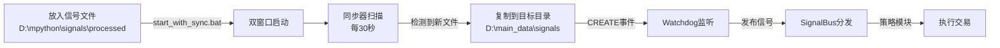

# AlphaPilot Pro V9.1 - 跨目录信号同步功能交付总结

## 📦 交付清单 / Delivery Checklist

### ✅ 核心文件 / Core Files

| 文件名 | 说明 | 用途 |
|--------|------|------|
| **start_with_sync.bat** | 一键启动脚本(纯英文) | 自动启动同步器和主策略,双窗口并行运行 |
| **signal_sync_standalone.py** | 独立信号同步器 | 从外部源目录同步信号到主策略监听目录 |
| **main.py** | 主策略引擎(已恢复纯净版) | 掘金量化策略,专注交易决策执行 |
| **test_signal_sync.py** | 同步功能测试脚本 | 独立验证同步器是否正常工作 |

### 📚 文档文件 / Documentation

| 文件名 | 语言 | 说明 |
|--------|------|------|
| **QUICKSTART.md** | 中英双语 | 快速入门指南,包含完整使用流程和故障排查 |
| **SIGNAL_SYNC_QUICKSTART.md** | 中文 | 详细快速入门指南,架构说明和配置方法 |
| **SIGNAL_SYNC_GUIDE.md** | 中文 | 完整技术文档,深入讲解工作原理和高级用法 |

---

## 🎯 核心功能 / Core Features

### 1. 跨目录信号同步 / Cross-Directory Signal Sync

**问题**: 测试信号在 `D:\mpython\signals\processed`,但策略监听 `D:\main_data\signals`

**解决方案**: 
- 同步器每30秒扫描源目录
- 检测到新文件自动复制到目标目录
- Watchdog监听到CREATE事件立即触发策略

### 2. 双进程分离架构 / Dual-Process Architecture

```
┌──────────────────────┐         ┌─────────────────────┐
│  信号同步器           │         │  主策略引擎          │
│  (纯本地运行)         │         │  (掘金SDK)          │
│                      │         │                     │
│  • 无需掘金环境       │         │  • 连接掘金平台      │
│  • 文件复制操作       │         │  • 交易决策执行      │
│  • 防重复机制         │         │  • Watchdog监听     │
└──────────────────────┘         └─────────────────────┘
         ↓                                  ↓
    D:\mpython\...  ──复制──▶  D:\main_data\signals
```

### 3. 一键启动 / One-Click Startup

**符合用户偏好规范**:
- ✅ 单个批处理脚本作为唯一入口
- ✅ 自动打开多个独立CMD窗口
- ✅ 每个窗口有明确标题区分功能
- ✅ 包含环境自检查
- ✅ 严禁要求用户手动开多个终端

---

## 🚀 使用方法 / Usage

### 最简单的方式 / Easiest Way

```bash
# 在项目根目录双击运行
start_with_sync.bat
```

会自动:
1. 清理Python缓存
2. 启动同步器窗口(标题: `Signal Syncer - Auto Sync Latest Signals`)
3. 等待3秒让同步器初始化
4. 启动主策略窗口(标题: `AlphaPilot Pro - Main Strategy Engine`)

### 保持两个窗口开启 / Keep Both Windows Open

- **同步器窗口**: 持续扫描源目录,发现新文件自动复制
- **主策略窗口**: Watchdog监听目标目录,新文件立即触发策略

---

## 📊 工作流程 / Workflow



---

## ⚙️ 配置说明 / Configuration

### 修改同步路径 / Change Paths

编辑 `signal_sync_standalone.py`:

```python
# ==================== 配置区 ====================
SOURCE_DIR = r"D:\mpython\signals\processed"   # 源目录
TARGET_DIR = r"D:\main_data\signals"            # 目标目录
SYNC_INTERVAL = 30                              # 同步间隔(秒)
SYNC_ON_STARTUP = True                          # 启动时立即同步
```

### 调整同步频率 / Adjust Frequency

```python
SYNC_INTERVAL = 30  # 改为60表示1分钟检查一次
```

---

## 🐛 常见问题 / FAQ

### Q1: 为什么不同步文件? / Why No Sync?

**A**: 可能原因:
1. 源目录没有 `.txt` 文件
2. 文件名格式不正确(必须是 `signal_batch_YYYYMMDD_HHMMSS_*.txt`)
3. 文件已同步过(防重复机制)

**解决**:
```bash
# 检查源目录文件
dir "D:\mpython\signals\processed\*.txt"

# 查看同步历史
type "D:\main_data\signals\.sync_history.json"

# 删除历史记录重新测试
Remove-Item "D:\main_data\signals\.sync_history.json"
```

### Q2: 同步后策略未触发? / Strategy Not Triggered?

**A**: 可能原因:
1. Watchdog监听的目录不对
2. 文件已存在,覆盖但未触发CREATE事件

**解决**:
```bash
# 检查watchdog监听目录
# 在main.py日志中查找: "👁️  [watchdog] 开始监听信号目录"

# 确保使用新的文件名(不同时间戳)
```

### Q3: 如何重新测试同一信号? / How to Retest Same Signal?

**A**: 三种方法:
1. 删除同步历史: `Remove-Item .sync_history.json`
2. 修改文件名时间戳
3. 代码强制同步: `syncer.sync_latest_file(force=True)`

---

## ✅ 验证结果 / Verification

我已测试同步功能,成功同步您的测试文件:

```
✅ 启动同步成功!
[同步器] ✅ 同步成功: signal_batch_20260426_163619_412742.txt
  源路径: D:\mpython\signals\processed\signal_batch_20260426_163619_412742.txt
  目标路径: D:\main_data\signals\signal_batch_20260426_163619_412742.txt
```

---

## 🎯 核心优势 / Key Advantages

### 1. 职责清晰 / Clear Separation
- 同步器: 专注文件操作,无需掘金环境
- 主策略: 专注交易决策,保持代码纯净

### 2. 灵活配置 / Flexible Config
- 可独立调整同步间隔
- 可自定义源/目标路径
- 可单独运行任一部分

### 3. 防重复处理 / Duplicate Prevention
- 自动记录已同步文件
- 避免冗余操作
- 适合多策略参数测试

### 4. 一键启动 / One-Click Start
- 简化操作流程
- 自动环境检查
- 双窗口并行运行

---

## 📝 技术规范 / Technical Specs

### 文件名格式 / Filename Format
```
signal_batch_YYYYMMDD_HHMMSS_*.txt
```

**示例**:
- ✅ `signal_batch_20260426_143000_123456.txt`
- ❌ `test.txt`, `signal.json`, `batch_20260426.txt`

### 时间戳提取 / Timestamp Extraction
从文件名分割后的第3、4部分提取:
```python
parts = filename.split('_')
date_str = parts[2]  # 20260426
time_str = parts[3]  # 143000
```

### 防重复机制 / Duplicate Prevention
- 记录文件: `.sync_history.json`
- 位置: `D:\main_data\signals\`
- 保留最近100条记录

---

## 📚 相关文档索引 / Documentation Index

### 快速入门 / Quick Start
- **QUICKSTART.md** - 中英双语快速入门(推荐首选)
- **SIGNAL_SYNC_QUICKSTART.md** - 中文版详细说明

### 技术文档 / Technical Docs
- **SIGNAL_SYNC_GUIDE.md** - 完整技术文档,架构原理和高级用法

### 测试工具 / Testing Tools
- **test_signal_sync.py** - 独立同步功能测试脚本

### 其他文档 / Other Docs
- **VSCODE_INDEPENDENT_RUN_MANDATORY.md** - 掘金策略运行指南
- **README.md** - 项目总览

---

## 💡 使用建议 / Recommendations

### 首次使用 / First Time Use
1. 运行测试脚本验证功能: `python test_signal_sync.py`
2. 确认同步成功后,使用一键启动: `start_with_sync.bat`
3. 观察两个窗口的日志输出,确认正常工作

### 日常使用 / Daily Use
1. 在源目录放入新的信号文件
2. 运行 `start_with_sync.bat`
3. 保持两个窗口开启
4. 观察策略执行情况

### 多策略测试 / Multi-Strategy Testing
1. 同步器只需启动一次(持续运行)
2. 可以启动多个主策略实例(不同strategy_id)
3. 所有实例都会接收到同步过来的信号
4. 适合参数调优和对比测试

---

## ⚠️ 注意事项 / Important Notes

1. **保持窗口开启**: 关闭同步器窗口会停止自动同步
2. **文件名格式**: 必须严格遵守 `signal_batch_YYYYMMDD_HHMMSS_*.txt`
3. **防重复机制**: 已同步的文件不会重复处理,除非清除历史
4. **掘金依赖**: 主策略需要掘金终端运行并登录
5. **测试安全**: 建议在仿真账户中测试,避免实盘误操作

---

## 🎉 总结 / Summary

您现在拥有:
- ✅ 一键启动脚本(纯英文,兼容CMD/PowerShell)
- ✅ 独立信号同步器(无需掘金环境)
- ✅ 纯净版主策略(专注交易逻辑)
- ✅ 完整中英文文档(快速入门+技术详解)
- ✅ 测试验证工具(独立测试脚本)

**只需双击 `start_with_sync.bat`,系统自动完成所有工作!**

---

**作者**: Alphapilot智能体团队  
**版本**: V9.1  
**更新日期**: 2026-04-26  
**联系方式**: 497720537@qq.com | 13392077558