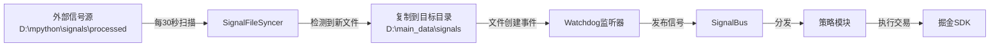

# 跨目录信号同步功能使用指南

## 📋 功能说明

AlphaPilot Pro V9.1 现已集成**跨目录信号同步器**,可自动从外部信号源(如 `D:\mpython\signals\processed`)同步最新信号文件到主策略监听目录(`D:\main_data\signals`),触发 watchdog 事件驱动处理。

## ✅ 已完成修改

### 1. main.py 集成同步器

在 `main.py` 的 `init()` 函数中已添加:
- **启动时立即同步**: 程序启动时自动复制最新信号文件
- **后台定时同步**: 每30秒检查一次源目录,发现新文件自动复制
- **防重复机制**: 通过 `.sync_history.json` 记录已同步文件,避免重复处理

### 2. 测试脚本

提供 `test_signal_sync.py` 用于独立测试同步功能:
```bash
python test_signal_sync.py
```

## 🚀 使用方法

### 方式1: 直接启动 main.py (推荐)

```bash
python main.py
```

系统会自动:
1. 从 `D:\mpython\signals\processed` 检测最新信号文件
2. 复制到 `D:\main_data\signals`
3. watchdog 监听到文件创建事件,立即触发策略处理
4. 后台每30秒检查一次新文件

### 方式2: 先测试同步功能

```bash
# 步骤1: 测试同步器
python test_signal_sync.py

# 步骤2: 确认同步成功后,启动主策略
python main.py
```

## 📂 目录结构

```
D:\mpython\signals\processed\          ← 源目录(外部信号归档)
├── signal_batch_20260424_155619_*.txt  ← 您的测试文件
└── ...

D:\main_data\signals\                   ← 目标目录(策略监听)
├── signal_batch_20260424_155619_*.txt  ← 同步过来的文件
├── .sync_history.json                  ← 同步历史记录
└── processed/                          ← 已处理信号归档
```

## 🔧 配置说明

如需修改同步路径,编辑 `main.py` 的 `init()` 函数:

```python
# ==================== 第六步：初始化跨目录信号同步器【新增】====================
SOURCE_DIR = r"D:\mpython\signals\processed"   # 源目录(外部信号归档)
TARGET_DIR = settings.SIGNAL_DIR_INPUT          # 目标目录(策略监听)
SYNC_INTERVAL = 30                              # 同步检查间隔(秒)
```

## 💡 工作流程



## ⚠️ 注意事项

1. **文件名格式**: 必须为 `signal_batch_YYYYMMDD_HHMMSS_*.txt` 格式
2. **防重复机制**: 已同步的文件不会重复处理,除非使用 `force=True`
3. **同步历史**: 记录保存在 `D:\main_data\signals\.sync_history.json`
4. **时间戳提取**: 从文件名第3、4部分提取日期和时间(见记忆规范)
5. **测试建议**: 首次使用建议先运行 `test_signal_sync.py` 验证功能

## 🐛 故障排查

### 问题1: 同步器未启动

**现象**: 日志中没有看到 `[信号同步器]` 相关输出

**解决**: 
- 确认使用的是修改后的 `main.py`
- 检查 `from utils.signal_syncer import SignalFileSyncer` 导入是否成功

### 问题2: 文件未同步

**现象**: 源目录有文件,但目标目录没有

**排查步骤**:
```bash
# 1. 检查源目录是否有.txt文件
dir "D:\mpython\signals\processed\*.txt"

# 2. 运行测试脚本
python test_signal_sync.py

# 3. 查看同步历史
Get-Content "D:\main_data\signals\.sync_history.json"
```

### 问题3: 同步后watchdog未触发

**现象**: 文件已复制到目标目录,但没有看到 `📩 [watchdog] 检测到新信号`

**原因**: 
- watchdog 只监听**新文件创建事件**,如果文件已存在会被覆盖但不会触发事件

**解决**:
- 确保同步时先删除旧文件再复制(代码已实现)
- 或在源目录放入全新的信号文件

## 📊 测试验证

运行测试脚本后应看到:
```
✅ 同步器初始化: 成功
✅ 文件检测: 成功
✅ 文件同步: 成功
✅ 防重复机制: 正常
✅ 强制同步: 成功
```

启动 `main.py` 后应看到:
```
🔄 [信号同步器] 初始化跨目录信号同步
  源目录: D:\mpython\signals\processed
  目标目录: D:\main_data\signals
  同步间隔: 30秒
🚀 [信号同步器] 启动时同步最新信号...
✅ [信号同步器] 启动同步成功!
⏰ [信号同步器] 后台自动同步已启动
👁️  [watchdog] 开始监听信号目录: D:\main_data\signals
📩 [watchdog] 检测到新信号: signal_batch_20260424_155619_412740.txt
```

## 🎯 使用场景

1. **多策略参数测试**: 无需生成大量信号文件,复用同一信号测试不同参数
2. **跨项目信号共享**: 从其他项目的信号归档快速同步测试
3. **历史数据回测**: 批量同步历史信号进行策略验证
4. **快速调试**: 手动放置测试文件到源目录,立即触发策略处理

---

**作者**: Alphapilot智能体团队  
**版本**: V9.1  
**更新日期**: 2026-04-26