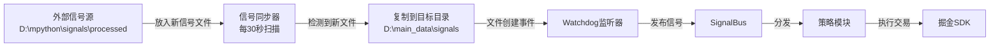

# AlphaPilot Pro V9.1 - 跨目录信号同步使用指南

## 📋 架构说明

系统采用**双进程分离架构**,职责清晰:

```
┌─────────────────────────┐         ┌──────────────────────────┐
│  进程1: 信号同步器       │         │  进程2: 主策略引擎        │
│  (signal_sync_...)      │         │  (main.py)               │
│                         │         │                          │
│  ✅ 纯本地文件操作       │         │  ✅ 掘金量化SDK          │
│  ✅ 无需掘金环境         │         │  ✅ 交易决策执行          │
│  ✅ 独立运行             │         │  ✅ watchdog监听         │
│                         │         │                          │
│  源目录 → 目标目录       │────▶    │  目标目录 → 策略处理      │
│  D:\mpython\...         │  复制   │  D:\main_data\signals    │
└─────────────────────────┘         └──────────────────────────┘
```

## 🚀 快速开始

### 方式1: 一键启动(推荐)

```bash
start_with_sync.bat
```

自动完成:
1. ✅ 清理Python缓存
2. ✅ 启动信号同步器(独立窗口)
3. ✅ 等待3秒让同步器初始化
4. ✅ 启动主策略引擎(独立窗口)

### 方式2: 手动启动

```bash
# 终端1: 启动信号同步器
python signal_sync_standalone.py

# 终端2: 启动主策略
python main.py
```

## 📂 工作流程



## ⚙️ 配置说明

### 修改同步路径

编辑 `signal_sync_standalone.py`:

```python
# ==================== 配置区 ====================
SOURCE_DIR = r"D:\mpython\signals\processed"   # 源目录
TARGET_DIR = r"D:\main_data\signals"            # 目标目录
SYNC_INTERVAL = 30                              # 同步间隔(秒)
SYNC_ON_STARTUP = True                          # 启动时立即同步
```

### 防重复机制

- 已同步的文件记录在 `D:\main_data\signals\.sync_history.json`
- 同一文件不会重复同步,除非手动清除历史记录
- 适合多策略参数测试,避免重复处理

## 💡 使用场景

### 场景1: 单信号快速测试

```bash
# 步骤1: 在源目录放入一个测试信号
# D:\mpython\signals\processed\signal_batch_*.txt

# 步骤2: 一键启动
start_with_sync.bat

# 步骤3: 观察两个窗口的日志
# - 同步器窗口: 看到 "✅ 启动同步成功!"
# - 主策略窗口: 看到 "📩 [watchdog] 检测到新信号"
```

### 场景2: 多策略并行测试

```bash
# 终端1: 同步器(持续运行)
python signal_sync_standalone.py

# 终端2: 策略A(参数组合1)
python main.py

# 终端3: 策略B(参数组合2) - 需要修改strategy_id
# 在另一个掘金策略实例中运行
```

### 场景3: 历史信号批量回测

```python
# 使用测试脚本
python test_signal_sync.py

# 会显示:
# ✅ 同步了 N 个文件
```

## 🔍 故障排查

### 问题1: 同步器未检测到文件

**检查清单**:
```bash
# 1. 确认源目录有.txt文件
dir "D:\mpython\signals\processed\*.txt"

# 2. 检查文件名格式
# 正确: signal_batch_20260426_143000_123456.txt
# 错误: test.txt, signal.json

# 3. 查看同步历史
Get-Content "D:\main_data\signals\.sync_history.json"
```

### 问题2: 同步后watchdog未触发

**可能原因**:
- 文件已存在,被覆盖但未触发CREATE事件
- watchdog监听的目录与实际不同

**解决**:
```bash
# 检查watchdog监听目录
# 在main.py日志中查找: "👁️  [watchdog] 开始监听信号目录"

# 确保目标目录正确
echo $env:SIGNAL_DIR_INPUT  # 应为 D:\main_data\signals
```

### 问题3: 文件已同步过,无法重新测试

**解决方法**:
```bash
# 方法1: 删除同步历史
Remove-Item "D:\main_data\signals\.sync_history.json"

# 方法2: 在源目录放入新的信号文件
# 修改文件名中的时间戳即可

# 方法3: 使用强制同步(代码层面)
# syncer.sync_latest_file(force=True)
```

## 📊 预期日志输出

### 同步器窗口
```
======================================================================
🔄 AlphaPilot Pro - 信号文件同步器(独立运行模式)
======================================================================
[配置] 源目录: D:\mpython\signals\processed
[配置] 目标目录: D:\main_data\signals
[配置] 同步间隔: 30秒

[同步器] 初始化完成
  已同步文件数: 3

🚀 [启动同步] 同步最新信号文件...
[同步器] ✅ 同步成功: signal_batch_20260426_163619_412742.txt
✅ 启动同步成功!

⏰ [自动同步] 每 30 秒检查一次...
[同步器] 自动同步线程已启动

💡 [提示] 同步器已在后台运行
```

### 主策略窗口
```
👁️  [watchdog] 开始监听信号目录: D:\main_data\signals
💡 [提示] 新信号文件将立即触发处理（零扫描开销）
📩 [watchdog] 检测到新信号: signal_batch_20260426_163619_412742.txt
[策略] 开始处理信号...
```

## ⚠️ 注意事项

1. **保持同步器窗口开启**: 关闭后不再自动同步新文件
2. **文件名格式**: 必须为 `signal_batch_YYYYMMDD_HHMMSS_*.txt`
3. **防重复机制**: 已同步的文件不会重复处理
4. **时间戳提取**: 从文件名第3、4部分提取(见记忆规范)
5. **测试建议**: 首次使用先运行 `test_signal_sync.py` 验证

## 🎯 核心优势

✅ **职责分离**: 同步器专注文件操作,主策略专注交易决策  
✅ **独立运行**: 同步器无需掘金环境,降低依赖复杂度  
✅ **灵活配置**: 可独立调整同步间隔和路径  
✅ **防重复处理**: 自动记录历史,避免冗余操作  
✅ **一键启动**: 简化操作流程,降低使用门槛  

---

**作者**: Alphapilot智能体团队  
**版本**: V9.1  
**更新日期**: 2026-04-26  
**相关文档**: 
- SIGNAL_SYNC_GUIDE.md (详细技术文档)
- VSCODE_INDEPENDENT_RUN_MANDATORY.md (掘金策略运行指南)